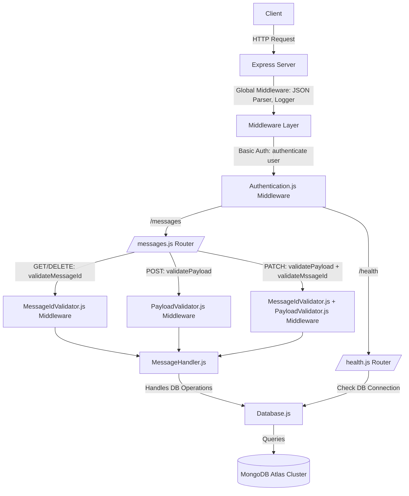

# Messages API

A simple RESTful API for creating, retrieving, updating, and deleting messages.

## Base URL
http://localhost:8080/

## Dependencies
1. Node.js v20.11.1

## Startup Instructions  
1. Clone this repository.
2. Open command prompt in the MessagesApp directory.
3. Run "npm install" to install all dependancies.
4. Run "cp .env.example .env".
5. Open the created .env file and fill in the DB_USERNAME and DB_PASSWORD fields with the provided database username and password.
6. Run "npm start".

## Unit Test Run Instructions
1. After first cloning the project run npx jest --init in a command prompt in the MessagesApp directory.
2. Run npm test in a command prompt in the MessagesApp directory.

## Authentication  
This API is authenticated using basic authentication. Ensure all requests send the provided clientid and secret, otherwise an authentication error will occur.  
  
Error Code: 401 Unauthorized.

# Endpoints

### 1. Create a Message

**POST** `/messages`

**Description:** Creates a new message.

**Request Body:**  
The field message must be a string between 1 and 1000 characters.

```json
{
    "message" : "civic"
}
```
**Response: (201 Created)**
```json
{
    "messageId": "68c372b6f12a19c9f16991fe",
    "status": "Created"
}
```
**Error Response 400:**  
Occurs when the payload is malformed.

```json
{
    "errors": [
        {
            "instancePath": "/message",
            "schemaPath": "#/properties/message/minLength",
            "keyword": "minLength",
            "params": {
                "limit": 1
            },
            "message": "must NOT have fewer than 1 characters"
        }
    ]
}
```
**Error Response 500:**    
Internal Server Error.
```json
{
    "error": "Internal Server Error"
}
```
### 2. Get All Messages

**GET** `/messages`

**Description:** Retrieves all messages.

**Response: 200**
```json
{
    "messages": [
        {
            "_id": "68c377f8f12a19c9f1699200",
            "message": "yerer",
            "isPalindrome": false
        },
        {
            "_id": "68c377fff12a19c9f1699201",
            "message": "racecar",
            "isPalindrome": true
        }
    ]
}
```
**Error Response 500:**    
Internal Server Error.
```json
{
    "error": "Internal Server Error"
}
```
### 3. Get Message By ID

**GET** `/messages/{id}`

**Description:** Retrieves a message with the provided unique ID

**Response: 200**
```json
{
    "_id": "68c377fff12a19c9f1699201",
    "message": "racecar",
    "isPalindrome": true
}
```
**Response: 400**  
Returned if the provided message ID is invalid or does not exist.
```json
{
    "messageId": "68c37484f12a19c9f16991ff",
    "error": "Message Not Found"
}
```

**Error Response 500:**    
Internal Server Error.
```json
{
    "error": "Internal Server Error"
}
```
### 4. Update Message

**PATCH** `/messages/{id}`

**Description:** Updates the message with the provided ID.

**Request Body:**  
The field message must be a string between 1 and 1000 characters.

```json
{
    "message" : "civic"
}
```

**Response: 200**
```json
{
    "messageId": "68c377fff12a19c9f1699201",
    "status": "Updated"
}
```
**Response: 400**  
Returned if the provided message ID is invalid or does not exist.
```json
{
    "messageId": "68c37484f12a19c9f16991ff",
    "error": "Message Not Found"
}
```

**Error Response 500:**    
Internal Server Error.
```json
{
    "error": "Internal Server Error"
}
```
### 5. Delete Message

**DELETE** `/messages/{id}`

**Description:** Deletes a single message with the provided unique ID

**Response: 200**
```json
{
    "messageId": "68c377fff12a19c9f1699201",
    "status": "Deleted"
}
```
**Response: 400**  
Returned if the provided message ID is invalid or does not exist.
```json
{
    "messageId": "68c37484f12a19c9f16991ff",
    "error": "Message Not Found"
}
```

**Error Response 500:**    
Internal Server Error.
```json
{
    "error": "Internal Server Error"
}
```
### 6. Health

**GET** `/health`

**Description:** Ensures the app is running and that it can connect to the database and perform read, write, and delete operations.

**Response: 200**
```json
{
    "dbWritePassed": true,
    "dbReadPassed": true,
    "dbDeletePassed": true
}
```
**Error Response 500:**    
Internal Server Error.  
The response payload outlines which database operations failed.
```json
{
    "dbWritePassed": false,
    "dbReadPassed": true,
    "dbDeletePassed": true
}
```
## Notes
1. The field 'Palindrome' indicates whether the provided message is a palindrome. This is derived before DB insertion. It is updated based on the provided message when a PATCH request is sent
2. IDs are MongoDB ObjectIds in string format.

## Architecture Diagram


